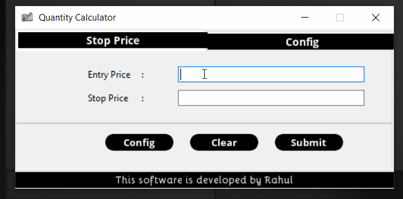

# quantity-calculator

A Quantity calculator which suggests you best position size following your Risk Management.

# Table of Content

1. [Basics](#Basics-of-Quantity-Calculation-(Position-Sizing))
2. [Prerequisites](#Prerequisites)
3. [Installation](#Installation-and-Setup)
4. [Features](#Features)
5. [License](#License)

# Basics of Quantity Calculation (Position Sizing)

Position Sizing, One of the most ignored aspects of trading by new traders. Generally in new traders I have seen a desire to use the entire capital for trading. First thing a trader should lose is the idea of using entire capital every trade. How much capital to use, what quantity to buy, these are defined by position sizing.

# Prerequisites

Before you continue, ensure you have met the following requirements.

1. You are using a Windows OS Machine.

# Installation and Setup
You can get step by step detailed Installation steps [here](readme_media/INSTALLATION.md) for both windows and linux.

* Go to [Releses](https://github.com/404notfound-3/quantity-calculator/releases) and [download](https://github.com/404notfound-3/quantity-calculator/releases/download/2021.1/Quantity.Calculator-2021.1-amd64.msi) latest installer file.

* Head to installer File in your File Explorler and double click to run it.
* Finish the installtion by choosing defult options.

Congratulations! you are ready to go now.  Ping [me](https://facebook.com/404notfound.3) if you ever face any kind of error.

# Features
1. Position size calculation using stop price
2. Custom Account size configuration
3. Custom Risk per trade configuration
4. Switch tabs using arrow keys (⬅ ➡)
5. Save config file in `config.txt`

# License
Project License can be found [here](https://github.com/404notfound-3/quantity-calculator/blob/master/LICENSE)

MIT © [Rahul Meena](https://facebook.com/404notfound.3)